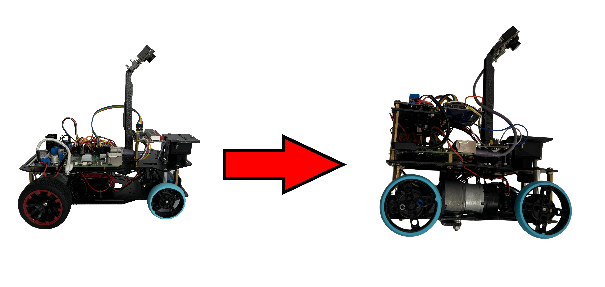
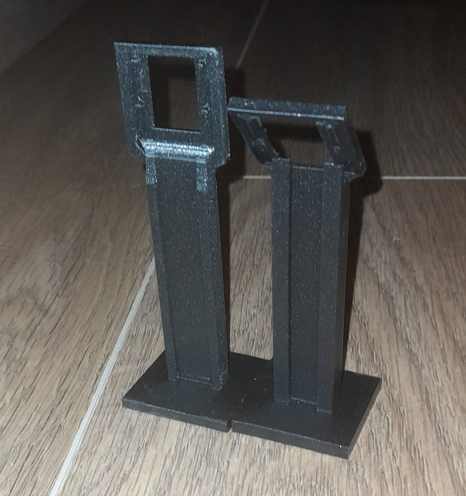
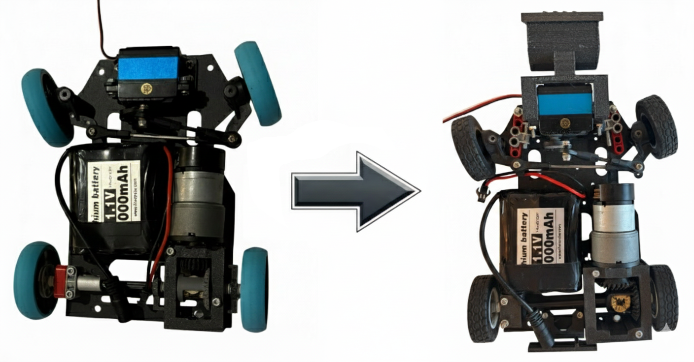
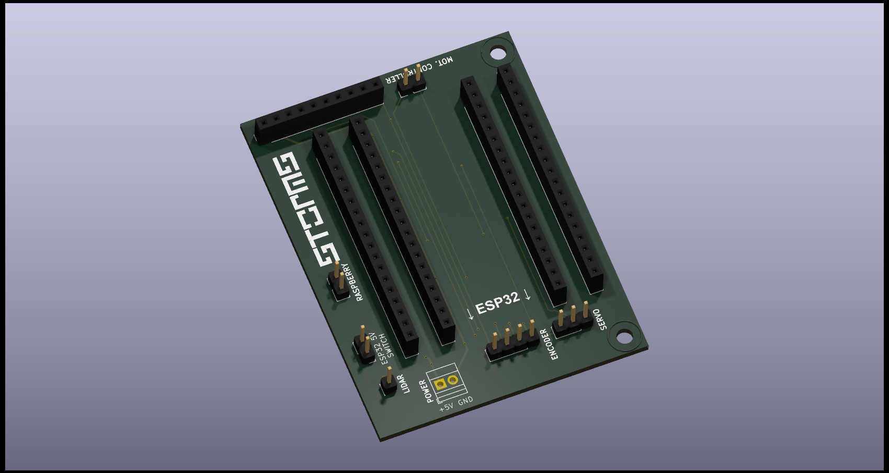
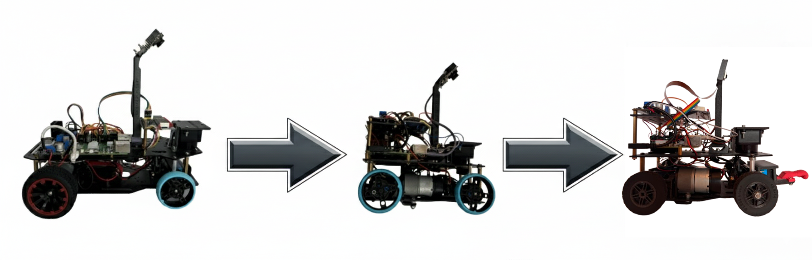
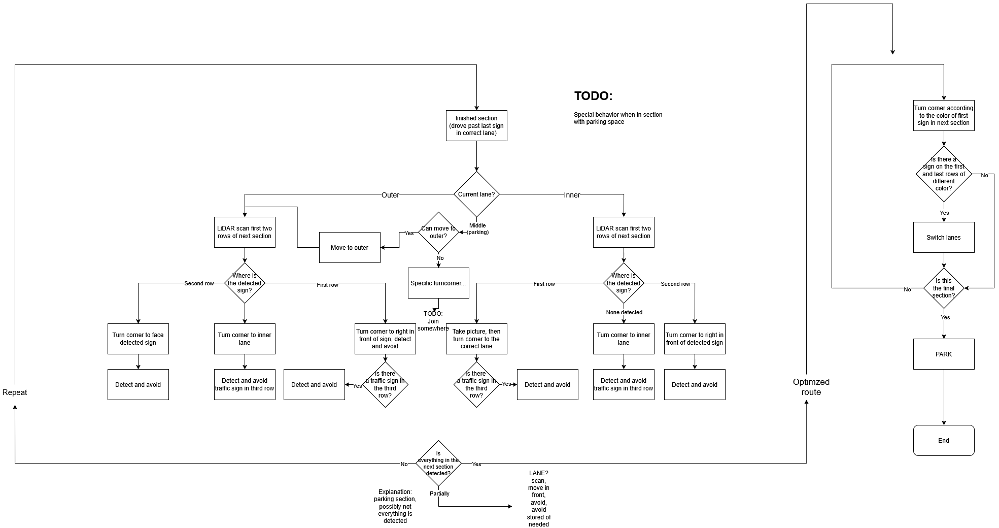

# Our journey

In this segment, we'll focus on our development process throughout the years. The challenges we faced, the engineering decisions we made, and how the final design of our robot came to be.

## Our history in WRO

Before we begin talking about anything technical we think it is important to mention the past, because it might make it more clear why we made some decisions previously, and where our engineering experience stems from. It might be a bit long, but its hard to summarize so many years in just a few sentences. 

### Before FE
 
Before Future Engineers, all our team members were competing in the Robomission category, although not necessarily in the same team nor age group. There, we picked up a lot of useful skills and knowledge, like the **basics of motor and gyro usage, the idea behind the PID** controller. We learned as much as we could within the category, but after a few years we wanted to take on a mature challenge, so we decided to give Future Engineers a try in 2024.  

### FE 2024
It was our first time doing anything this advanced so we decided to take a slow and steady approach. We did not really care about speed at all, we just wanted to make something that worked and was reliable. Our experience was mostly with software, **so we were hesitant to when it came to mechanical solutions** (like making a differential gear), and we also took an approach that was more similar to a Robomission robot (building our run from highly modular, but slower parts, rather than a fully dynamic solution). **We were new and inexperienced** both in mechanics and electronics, but somehow everything went amazingly and we ended up winning the International Final.  

### FE 2025
The next we changed our philosophy and decided to focus on speed instead. There were minimal changes to the rules, so we predicted that time would play a more important role in the top positions that year. We already had a perfectly working robot, and while there would have been advantages in starting over, **we decided to rather just improve upon the design we already had.** We made upgrades in all areas, software, mechanics and electronics. We got a new camera, differential, we improved our strategy. With everything, **we managed to cut our runtime in half,** make everything smoother and more reliable. All in all 2025 was a lot more intense, with a lot more teams earning the maximum points on the challenge runs, but somehow we still managed to take third place, proving that the year before wasn't just a fluke.  
  
In short, the last few years gave us all kinds of skills and knowledge and wonderful foundation for our future. Some of us were just starting high school when we first attended the competition, and now in university we are still eager to compete.

---

## Our design process throughout the years

### The first design

Back in 2024, we first wanted to use a [3d printable car](https://www.instructables.com/3D-Printed-RC-Car/) we found online as a base. We didn't know where to start of from, and this would have provided us a decent foundation, but in the end we could not use it. As we progressed at assembling the car, **more and more things started going off the rails.** The build manual had a lot of steps and stl files left out, so even the build process was unreasonably difficult. **But biggest problem was that this car was meant to be a fast RC car for outside usage,** rather than something more precise.

---

### The 2024 design

  In order to get a working prototype as fast as possible we got a Hiwonder Ackerman Intelligent Car. This enabled the car to be more stable and fast, but we still ran into quite a few problems. The car was *exactly* the maximum size allowed, which made parking near-impossible at that time. For the national finals this was not a problem, but later on, we had to make a lot of improvements, such as changing the tires to Lego Spike tires, (because was the original ones were so wide that by turning the robot would exceed the size limit), or cutting the chassis into multiple pieces and making the the robot shorter and more agile, but taller.

  The most prominent issue we had to solve was the **differential gear.** The car came with two motors in the kit arranged for and electric differential drive. This was decided against by the head judges so we had to think of a solution as fast as possible. For the national finals we fixed the issue with wiring. **We wired it so that both motors would get the same input, but in reverse, causing them to always output the same rotational force.** This way we kept both the **power** and **speed** of both motors. However for the international championship we had to implement a differential gear solution. 
  After multiple iterations we ended up using a design which **mixes official lego elements, metal technic parts and custom 3d printed parts.**

  After our hardware issues were solved it was finally time to face the software ones. For the brains of the robot we ended up using both a Raspberry Pi 5 and an ESP 32. This was so that we could write really fast C code for our sensors, but still be able to write much easier Python code for the run logic. For general navigation we choose Lidar sensor, and and a Pixy Ai camera for color detection. **The latter needed a lot of work.** We used a Pixy Ai, so we could skip most of the heavy lifting, but were frustrated at the camera's surprisingly high inaccuracy. However, looking back, the solution was kind of obvious. If we can't see something clear enough, just go closer. We actually realized this **during** the national competition, where the lighting was very different from the one at home, and managed to implement a makeshift solution to increase detection accuracy above what we measured at home. Later, we perfected this approach and it proved to be quite effective at the time. The final thing we added was the parking logic, which added a lot of complexity to the already complex run, but after that, polishing and fine-tuning was all there left to do.

---

### The 2025 design

#### The planning phase

In 2025, after taking a break between seasons, we started working on the robot once again, but now with a lot more organized workflow.
In the first phase of development, we mostly did **planning and information gathering.** We already learned the year before just how important information was. At our first meeting we started by writing down the tasks for that year.

This was what we came up with:  

  >⬜ Getting new camera with manual image processing  
  >⬜ Making custom made differential gear with higher efficiency, speed and less play in the wheels  
  >⬜ Speeding up our Lidar sensor for a higher refresh rate  
  >⬜ Some kind of alignment protocol to correct any deviation, probably with wall alignment  
  >⬜ Maximize the documentation  
  >⬜ Fix any lingering problems from last years and make the robot overall more reliable

After this we searched up the most successful teams from last years and assigned everyone one or two documentations from those teams to review. This was really useful for us, since a lot of teams had great and interesting ways to solve this challenge, while also **learning what was required in the documentation** from analyzing the points they had gotten.

#### The development phase

The most important tasks we wanted to tackle first were the camera and the differential, since without these parts the robot couldn't even start moving.

##### The camera

In the year before, we used a Pixy Ai camera to do the color detection for us. It worked well enough for that season, but we found the camera to be a bit colorblind, so we decided to move onto a more manual approach.
Finding the right camera was the easiest part. We only had a few things we required:
- A large enough FOV
- Flat/non fisheye lenses
- Relatively easy integration.

After just a bit of searching we landed on the **Raspberry Pi Camera Module 3.**
This camera had everything we needed. A FOV of 66° horizontal and 41° vertical. Since we use a Raspberry Pi 5 as the brain of our robot and this is the official camera made for the Raspberry Pi, integration was easy as Pi(e). There was already a fully feature complete Python library made for it and the Raspberry even had a dedicated camera port.
The next part was getting the camera actually work. Making simple pictures was quite an easy task, but then it got a lot harder. First we had to test out the perfect height and angle the camera would need to be in order to get the right image.

This took quite a few tries but we found a 15° depression angle at a height of around 20 cm to be sufficient for our needs. These measurements allowed us to make a 3D printed camera stand that would hold the camera in the right place. Then came the logic of the camera.
Our idea was to use the measurements from our **Lidar sensor to pinpoint the location of the obstacle** on a and then take the average of all the pixels inside that area thus getting a value of how green and how red it is. This is why it was important that we used a flat lense, since this way we didn't have to account for camera distortion and could avoid using matrix equations, allowing us to use simple geometry for our solution. But even with this, there were problems we had to solve. For example only after a few weeks did we realize that the camera **wasn't using its maximum FOV,** which was crucial for our calculations. Other than this we also had to be mindful about any modifications we made since then we had to update the camera's height and angle in the code. After a lot of fiddling and optimizing, **it worked beautifully.** While still not perfect it was already miles ahead in reliability compared to the Pixy cam.  
  
>✅ Getting new camera with manual image processing  

##### The differential

The differential was one of the most important challenges we had to face mechanically. While the Lego differential we used originally worked fine, it wasn't the ideal. The wheels had a lot of play and the transmission was far from ideal. The motor we used was quite powerful with more than enough torque than we would ever need so we could afford to lose some. Thus **we decided on making a custom differential** with a 1:1 gear ratio, a lot tighter fittings and imbedded bearings to decrease friction and make things more secure.
Making a differential is a lot harder than just slapping some cogs together, It requires data and calculations. The modelling wasn't an easy task either, since **all the components had to fit together perfectly** and we wanted to use the axles from last year requiring it to be compatible with Lego, while also having a D shaft as an input. 
After printing out the models we made, sanding out things where needed and doing some assembly everything seemed to work great. This addition made everything more precise and allowed us to reach even faster speeds, providing an increase of about 1.4 times and the asymmetric design of the gears made it a lot more efficient.

>✅ Making custom made differential gear with higher efficiency, speed and less play in the wheels  

##### The new motor

While the new differential already provided us with a decent speed bump, **we wanted more.** We managed to get maximum points the first year but our time was rather lacking compared to the other teams with similar results, so we knew we had to improve more. To further increase the speed of our robot we decided to get a new motor of the same kind we used before but with a better built in gear ratio. This change lowered our torque even further, but with the staggering 3 times speed boost it provided, we decided to take the trade. With change our maximum speed had reached **over 4.5 times what we had the previous year.**

##### Parking

The parking was one of the main rule changes that year. While the increased parking space was really useful, parallel parking still proved to be a lot more difficult than perpendicular parking. We first tried a method of basically wiggling our way out of the parking space, but that added a lot more complexity and was influenced too much by the play in the system. To fix this we had to **heavily modify our steering gear,** by moving up the servo and extending its range to the absolute limit. These changes allowed the robot to simple drive out of the parking space with one turn.

##### Speeding up the Lidar

The refresh rate of our Lidar was already a problem last year and since the speed of our robot has increased even further this problem did as well. The problem stems from the fact that the Lidar only spins 10 times a second, meaning that a given degree only refreshes every 0.1 seconds, so if the robot were to move at a speed of 1.5 m/s then **the robot could move 15 cm between two measurements,** making the run a lot more instable. With some trial and error we managed to get it up **from 10 to 15 Hz** which is still quite slow, but a decent enough improvement.

>✅ Speeding up our Lidar sensor for a higher refresh rate  

##### Wall alignment

We also needed some way to further stabilize the run. An issue that came up sometimes was that the gyro could slowly shift causing the robot to deviate from how far we wanted it to be from the wall. We fixed it by adding a little correction arcing each time we went in a straight line. The arc was just small enough that it **could do it without moving the Lidar.** This change made the robot a lot more predictable and reliable.

>✅ Some kind of alignment protocol to correct any deviation, probably with wall alignment

##### Predictive gyro

Just like Lidar, we had issues with the refresh rate of the gyro as well, but with turning. However we could use a more robust solution this time, since the gyro on outputs one value and that value cannot have big jumps in it. We decided on using an interpolation method, basically **predicting the gyro values based on previous data,** allowing us to end turns at just the right time.

##### Troubleshooting

In the development process we also encountered some rather peculiar and informative issues. Those are listed below:

* We noticed some issues with the Lidar. First of all we noticed seemingly random 0 values appearing in our logs, that disappeared for some reason when we covered the robot with a box. Turns out when the light from the Lidar bounces away into world and does not return or goes further than 12 meters, the Lidar will say the distance was 0. Thankfully we could ignore those values. Another problem was the dead zone of the Lidar changing, but we could solve that by implementing dead zone management into our code.

* A problem with our motor also arose, when it started moving in an uneven throbbing fashion, that disappeared when we stopped controlling it. This was most likely caused by electromagnetic interference from one of the cables near the motor. After moving the cables, the problem disappeared.

* After the speed increase the tires of the robot started sliding a bit when braking and starting. This was easily fixed by replacing the back tires with ones that have more grip.

* When replacing the motor, we didn't account for the fact that it had a slightly shorter shaft, which later caused the cog to slip off from it. Fortunately the fix was just making the back of the cog a bit longer. 

>✅Fix any lingering problems from last years and make the robot overall more reliable

---

#### Optimizing and the finishing touches

The changes we made up till this point were made before the national competition as these were the bulk of what we had planned. These changes turned out great, however things like these **still needed a lot of polishing.** While there were no more huge changes that needed to be made, there were still things that required small improvements to be perfect. Just like before, we made a list of the things that we had to work on:

##### New motor controller

The first change we made was getting a new motor controller. While the previous one worked fine, it was quite big and inefficient, so we decided to get a new one. **The new one solved those issues and even made our robot go a lot quieter.**

##### Custom interconnect PCB

In order to save some space and ensure proper
wiring, we designed a custom PCB in [KiCad](https://www.kicad.org/). We had already made something similar before, but we decided to make a more sophisticated one this time around.
The PCB is designed to
house the ESP, and make connencting it to the other systems and parts of the robot a lot simpler and more intuitive.

Two mounting holes were added to allow us to affix the PCB using 2 M3 screws. In order to save some space, we also added a few redundant pins to the `GYRO1` element. This let us put the IMU right on the top of the PCB.

As a safety precaution and to ensure extensibility, all ESP pins were mirrored to their respective sides. This proved essential, because we failed to notice a critical mistake before ordering the PCB. ENC1 and ENC2 were 1 pin higher (below the +3V3 label), meaning that instead of ENC1 being connected to a programmable GPIO pin, it connected to the EN pin. This meant that, whenever the pin got any power, the enable pin triggered a reset in the ESP. While we lacked the time to order a new PCB before the competition, we could use a jumper connected to one of the pin mirrors to amend this issue. As for the files themselves, all PCB design documents contain a version where this wiring mistake has been fixed.

After every factor mentioned above has been dealt with, a BOM assembled, and the PCB ordered, the PCB was successfully integrated into the car (besides the EN miswiring mentioned above).

##### Filtering out errors in the raspberry - esp communication system

Communication between the computing units was always a tricky part. While most of the problems we encountered were fixed by this point, there was always a chance that any data we sent could get corrupted by the time it has reached its goal. We eased this problem by **integrating a checksum into our communication system,** which in short checks the sum of the message on both sides and compares them, thus being able to tell if the message was corrupted in any way.

##### Optimizing robot path to improve speed

Last year, our main focus was stability, while this year we also decided to focus on speed. While stability is still the most important aspect of the robot, we realized that also needed to shave off from the runtime as much as we could. We already massively improved the speed of the robot, but we knew that we could also gain time by just making it go a shorter distance. Previously this seemed impossible as there were problems with our turning angle, but we managed to **tweak some things in our turning gear, finally making this possible.**

##### Fine-tuning the sensors

The sensors are the eyes of the vehicle, so it was always very important that they worked "well", but that "well" part **could only be called "well enough" up to this point.** To change this we had to implement a few things.

First of all, we found that there was a proportional error in our IMU. Thankfully this was a constant value, so there was a constant difference in every 360 degrees, meaning that it was something that our ESP could handle easily by adjusting for it.

Then we also fixed the problem caused by the misalignment of the lidar and the camera. The solution was to check their angle compared to the straight axis (which is the axis perpendicular to the rear/driving axis of the car) and make a slight correction according to it.

Finally, to make finding problems easier in the future, we also added a few features to our debbuging program, like also implementing the camera images into the playback feature, and adding a menu to create different run presets to streamiline the testing process.

##### Improving the wheels

The final thing we did was to change out the wheels. With the robot being able to go much faster, the wheels we used before had started to slip. We could have just changed them to a bigger wheels with more grip, but that could have posed a problem when parking. Luckily we managed to find a pair of wheels **that fit both criteria of being thin and grippy,** so we started using those instead. After this the only thing left to fix was making them mount better on the front, since there we used screws for mounting, instead of an axle. For this we edited the 3d model of the rim, so that it could have **a nut inserted inside of it.** We did have to make a few versions of this design, since the first one did not turn out so well, but we did end up making a good one. These fixes were the last things we needed to do to complete the robot, and after doing so, the robot ended up working beautifully.

---

### The 2026 design

At the start of the year, we were quite sad to see that, like last year, the changes to the rules were minimal. While we obviously still had a lot of ideas in mind, we were already quite happy with our design, so we were hesitant to make big changes. But this does not mean that were sitting around doing nothing.

#### The planning phase

Once again, we started off by checking out the documentations of the best performing teams and **making a TODO list.**  

What we came up with this time:

  >⬜ Optimizing our strategy even further and increasing modularity.  
  >⬜ Making the robot more collision resistant.  
  >⬜ Improving our development process.    
  >⬜ Designing a new PCB.  
  >⬜ Improving our turning system.

##### The new strategy

Our main focus this year was on the new strategy. Last year, we discovered, that the deciding factor between teams with the same amount of points was the** time of only the obstacle challenge, not the sum of both of them.** This made our main concern speeding the obstacle challenge strategy.  
  
We started working on a new and improved, but much more complex strategy, as can be seen on the (WIP) flowchart above. This would have greatly increased our efficiency, but implementing it **would have taken a lot of time and testing.** Time, that sadly we did not have, due to university and school eating up most of it.  
Reluctantly, we reversed the changes we made and decided on a simpler, intermediate approach. The new strategy required less reversing, and made our robot slip less, in turn making it go into reverse even less. This approach, while still more complex, than the one before, required a lot less testing, thus **implementing it became actually feasible.** So we did. And thankfully, it worked really well.

>✅ Optimizing our strategy even further and increasing modularity.  

##### Collision resistance.
The shovel we used the year before for aesthetics, while looking great, was also quite fragile, breaking more than once. Due to this, we sadly had to part ways with it and instead printed a bumper, now using **soft TPU** in the shape a boxing glove hopefully dampening any frontal collisions in the future.

  >✅ Making the robot more collision resistant. 

##### The surprise rule

This year, finally a long awaited surprise rule was announced, giving us a new challenge to work on. When we were making our new strategy, one of our main concerns was modularity. This time, we knew that a surprise rule would be announced, so we made our code as **modular and extensible as possible.** This decision later came really handy, since it made solving the surprise challenge quite easy.

---

## Teamwork

We usually **met up once a week to work on this project,** but even when we weren't together we would work on it. We kept a log of all the times we worked on something. Everyone had a part of this project that they were the most familiar with, and so when we were not together we would usually work on those parts and then share our code snippets and unfinished or work in progress documentation via a private GitHub, finally publishing it on the official one. Any chance we got we would talk or text about what to do, what we should focus on, frequent communication was a key part of our work. We needed to have a clear goal every time in order to not get sidetracked and waste our time on the unimportant things. Every week when we met up, first we merged everything we did separately together and then did the things that all of us were needed for. This way even though we only met up once a week, **we could have a constant flow of progress.** It's important that even though every member of our team had an area of the project they were most familiar with, we still strived to introduce each other ot our own areas, so that everyone is familiar with the whole project as a whole. We believe this is necessary for efficient teamwork.

## The future

We made huge improvements over last few years, making the robot a lot faster and more reliable, making us very hopeful for this year's competition. While this is as good as the robot has ever been, we will always find new things to improve on.  
We already started designing an even newer version of our custom pcb, and were experimenting with a way to wirelessly update the ESP code at home (It is important to note that this feature will have a visual hardware toggle in order to comply with the rules of the competition). We also started discussing how we could make a custom chassis and steering system to improve agility and make our turns even tighter. Finally, we will try to implement that dreaded strategy one more time.

## Conclusion

Overall we are **incredibly happy with how our robot turned out** and glad we took upon this challenge and went on this journey together. We could successfully do all the things we had planned and even made some funny memories in the process. The process was hard, but worth it in the end and we hope to continue working on it in the future.

>✅ Maximize the documentation