# Software Architecture and Obstacle Strategy

This document serves to showcase all our different software solutions, that the ESP microcontroller and the Raspberry Pi serve as the basis of.
The Pi serves as the brain of the robot while the ESP is mostly responsible for low-level tasks. The base of our code is a custom framework, which runs on both platforms, written in Python on the Pi and in C++ on the ESP. It handles communication with different sensors, sometimes even byte-by-byte packet handling. It has a lot of movement, sensing, and high-level functions. When solving the open and obstacle challenge we applied one of our core principles of simplicity and broke both challenges down to their simplest forms.

This document also includes a software setup guide, detailing what libraries and environments we used and how to install them.

## Sensors and motors

The different communication protocols and libraries used between the components of the robot and their hierarchy:

The different communication protocols used between the components of the robot and their hierarchy:

- Computer
  - Raspberry Pi `SSH` **custom VScode extension**
    - ESP `UART` **custom serial protocol**
      - IMU `UART-RVC` **Adafruit_BNO08x_RVC library**
      - Motor encoder `Digital`
      - Motor driver `PWM` 2x`Digital`
      - Servo `PWM`
      - LiDAR (control) `PWM`
    - LiDAR (receive) `UART` **custom protocol implementation**
    - Led&Key panel `Data, Strobe, Clock` **TMBoard library**
    - Buzzer `Digital`
    - Camera `FFC` **picamera library**

Communication between the Raspberry Pi and the computer is handled by our custom-made Visual Studio Code extension, RpiCode. It creates the SSH connection over WiFi or Ethernet and enables us to upload or download files and even view live sensor data. More information about the extension can be found in the [RpiCode documentation](/other/RpiCode/README.md).

We use a plethora of different sensors and motors to make the robot go. For some of the sensors we simply used pre-made libraries for communication. This is usually the best decision as most of these libraries are made by the manufacturers themselves, who have the deepest understanding of the inner workings of the sensor. In other cases we had to write some simple code where most of the logic is setting pins to `HIGH` or `LOW` or detecting when pins change state. However in multiple cases for one reason or another we had to create our own solution. One of these cases is with the LiDAR sensor, as there were no Python libraries/solutions on the internet. We studied the [official developer documentation](https://www.elecrow.com/download/product/SLD06360F/LD19_Development%20Manual_V2.3.pdf) of the sensor, specifically the byte order in the serial communication. An image of that can be seen here: 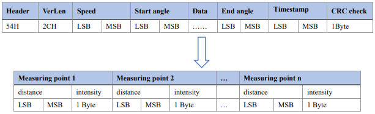

Our solution was to read the incoming data byte-by-byte and store every byte in an array until a full packet is received. The start of a packet is marked by the Header byte and since the packet byte-size is fixed, we read that many bytes. After this the packet is processed all at once. The sensor sends roughly 10 packets per second by default. Most numbers are in a two byte format, so we had to shift `M`ost `S`ignificant `B`yte then add the `L`east `S`ignificant `B`yte to get the full number. This part of the code can be found in [src/RaspberryPi/LidarService.py](/src/RaspberryPi/LidarService.py).
We also had to speed up the sensor to its maximum velocity, enabling us to receive measurements up to 15 times a second instead of 10, which was necessary to keep up with the high speed movement of the robot. This was done by sending a specific `PWM` signal from the ESP at a specific frequency. This proved challenging due to poor and lackluster documentation, our solution can be found in [src/ESP/run.ino](/src/ESP/run.ino) in the setup function.
However to receive 360 degrees worth of data 15 times a second would be 5400 measurements/sec, but the LiDAR only operates at 5000 Hz. This meant we wouldn't get measurement data for every degree. We solved this by detecting "gaps" and filling them with the measurement data of neighboring degrees.

Another case where we had to create our own communication solution was between the ESP microcontroller and the Raspberry Pi. Initially we used `I2C`, but it was unreliable so we switched to serial communication. We created our own protocol for two-way communication between the two devices. Since the ESP takes care of most sensor readings and the Pi needs up-to-date information we decided on a packet-based system where the ESP sends all sensor information 100 times a second. This packet is structured like this:

| isSynced | heading | encoderLeft | encoderRight | speed | vMode | sMode | logVar | checkSum |
|---|---|---|---|---|---|---|---|---|
| 1 byte | 4 bytes | 4 bytes | 4 bytes | 4 bytes | 1 byte | 1 byte | 4 bytes | 4 bytes |
| Is the ESP synced with the Pi | IMU heading angle | -EMPTY- since we have no left motor, legacy value | Right motor encoder position | Speed of the motors in encoder ticks/second | Velocity Mode, describes the current state of the motors such as forward, braking or unregulated | Steering mode, can be IMU-controlled, arcing or free | Log variable, used for debugging | checkSum value |

### Checksum
In every packet a checksum value is included. This is calculated by taking the modulus of every field with 256, adding them together, taking the modulus of the sum +1 with 256 again. Here's what it looks like in practice:
```python
(1+ (isSynced % 256) + (heading % 256) + ... + (logVar % 256) % 256)
```
This value is also calculated by the Raspberry Pi, and if the sent value doesn't match the packet is invalidated. The extra 1 is added so a stream of 0-s isn't a valid packet. The purpose of this checksum field is to help detect and fix communications problems with a helpful side-effect of possibly saving a run, it is not the fix itself.

### Commands

Since the ESP also controls the motors the Raspberry Pi needs to be able to send commands. These commands can be sent anytime, but they also follow a structure:

| CMD | params |
|---|---|
| 1 byte command identifier value | 3 byte command parameter |

We used little-endian to determine the order of the bytes. An example command to set the target speed (command identifier bytecode `0A`) to 1000 (in hexadecimal `E8` `03`) would look like this:

| 1. | 2. | 3. | 4. |
|:---:|:---:|:---:|:---:|
| `0A` | `E8` | `03` | `00` |

We use a 'heartbeat' system between the two units. The Raspberry Pi sends a heartbeat pulse every tenth of a second, and if the ESP doesn't receive this signal it stops all motors, resets the servo and updates its `isSynced` variable. This is a failsafe in case the Raspberry program crashes while the motors are on.

All of this code can be found in [src/RaspberryPi/ESP32_Service.py](/src/RaspberryPi/ESP32_Service.py) and [src/ESP/run.ino](/src/ESP/run.ino).

For the Led&Key panel we used a preexisting Python library that enabled us to set the display and the individual LEDs or check is a button is pressed.<br>Using the buzzer was also really simple, we just had to set the `+` pin to **HIGH** to start the sound and to **LOW** to stop it.

For the IMU we opted to use `UART-RVC` communication protocol, where RVC stands for Robot Vacuum Cleaner, since its most commonly used to help navigate robot vacuum cleaners. We choose this mode because this was the simplest one to implement, the sensor just sends the positional data 100 times a second.

For the encoders we registered the **A** and **B** pins as interrupt pins, and counted how many times they go from **HIGH** to **LOW** or vice-versa, per second, and this would tell us the speed of the robot, with one detection being one "tick". How this translates to cm/s depends on the gear ratio of the motor, the ratio of the differential gear and of course the diameter of the wheels. In our case one centimeter equals roughly 12.4 ticks. Our maximum speed is around 3200 ticks/second which comes out to roughly 260 cm/sec, or `2.6 m/s`. During the open challenge we drive at around 2500 ticks/s or `2 m/s`, and for the more precise obstacle challenge at around 800 ticks/second, `0.65 m/s`. We go as slow as 300 ticks/s, `0.24 m/s` during parking.

Steering with the servo is achieved by sending a `PWM` signal to the servo with the correct **dutycycle**. The same is true for the DC motor through the motor controller. More information about the mentioned libraries and how to install them can be found in the [software setup guide](#software-setup-guide).

For the camera we used the native `picamera` library with the Python opencv library, `cv2` for accessing the camera feed and performing image analysis.

## The framework - basics

The Raspberry Pi and the ESP microcontroller work together, the ESP mostly completing commands sent by the Pi. The code on the ESP is running constantly, and is made up of two core components: a Main Loop and a Timer Interrupt that uses the hardware clock on the ESP microcontroller to run exactly 100 times a second. The Main Loop is responsible for reading sensors, such as the IMU sensor and doing simple calculations such as automatic continous IMU angle counting which entails detecting when the IMU angle would loop over from 360° to 0° and adding 360° to the count. It is also sending data packets to the Raspberry Pi and receiving and executing commands.
<br>The Timer interrupt handles speed regulation and steering, both using `PID` regulation, taking into account the current `vMode` and `sMode`. These modes define the steering and driving of the robot, both of which is controlled on the lowest level by the ESP. The Raspberry Pi only needs to send the relevant parameters over then set the `sMode` and `vMode`, and the rest is handled by the ESP. For example to drive straight the Pi needs to send over the target speed, target angle then set `vMode` to `VMODE_FORWARD`, `sMode` to `SMODE_GYRO`, so the speed and direction keeping is handled by the ESP.

To ensure accurate arcing (handled on the ESP) we had to compensate for the speed of the servo. Since our servo takes a considerate amount of time to turn from the outermost position to the center (~0.2 seconds) waiting until the target angle is reached and then turning straight is not correct, as during this ~0.2 second the robot continues turning, missing the target angle. To combat this we introduced a `predictedYaw` variable which linearly interpolates based on the past gyro measurements 0.2 seconds into the future, which we use to stop when it reaches the target angle. This, of course, is far from a perfectly simulated calculation, but we were able to fine-tune the parameters for our use case with great results.

On the Pi side there are 3 important processes. There is the main thread running the challenge code. This thread is usually blocked waiting for condition, such as going *x* centimeters, or until the robot is *x* centimeters from the wall. This thread can also send commands to the ESP.

There is also a Communications process. This process is responsible for receiving data from the ESP and the LiDAR and process said data, storing it in easy to access variables and arrays. It is also responsible for sending heartbeat signals and handling Pi-side acceleration. Since multiple threads may communicate with the ESP we used a [Lock system](https://en.wikipedia.org/wiki/Lock_(computer_science)) which ensured that the two threads don't try to send commands to the ESP at the same time and end up mixing the byte order. This process also receives and processes data from the LiDAR sensor. It is really important that this thread doesn't get blocked since then we would't have up-to-date data, and the two devices might even fall out of sync. This is why we created the third process, the log thread.

This thread is responsible for writing all log data into files about 10 times a second so that later we can "rewatch" the robot run using the RpiCode tool, this is further explained in the [RpiCode documentation](/other/RpiCode/README.md). This includes log messages, current angle of the robot but also the current view of the LiDAR 10 times a second. The logs also contain every "LiDAR operation" conducted in that 1/15 second, such as checking the distance in an angle using `readLidar` or using `findNearestPoint`. We found that this many file operations can sometimes cause delay, however this thread intentionally doesn't do anything critical, in the worst case we will receive log messages a little later.

Finally, we run image analysis on a separate processor core (not thread as that can be blocked by incorrect task scheduling), so this way the resource intensive processing doesn't interfere with the regular operation of the robot and more time-sensitive operations.

## Framework - functions

We knew we wanted a really simple yet reliable framework as we found during our previous competitions in robomission that a good framework is extremely important. It can both make writing challenge code easier and trivialize implementing small rule changes each year.

The framework is made up of movement, sensing and high-level functions.

### Movement-related functions:

For movement we have an absolute-angle-system, which means that instead of turning 90° degree we turn *to* the 90° position, which will always be *right*. We have a global *tempo* variable set by `setTempo()` which provides us with an abstraction layer over the control of the robot's speed. It is detailed in the [High-level functions section](#high-level-functions).

`settargetSpeed(targetSpeed)`<br>
Sets the Pi-side acceleration target to `targetSpeed`. The Pi will gradually accelerate (or deccelerate) to this speed while sending over the current speed to the ESP.

`go(direction, speed_override)`<br>
The most important movement function, it starts the motors and tells the ESP the target direction (absolute). The speed will be the current *tempo*, unless `speed_override` is specified, in which case it goes with the parameter's value, without changing the *tempo*. After sending the commands the function returns, it's non-blocking and takes negligible time to run.

`goUnreg(force, direction)`<br>
Tells the ESP to start the motors with constant `force` instead of using the PID speed control algorithm, and `direction` (absolute).

`waitCM(cm)`<br>
Blocks execution until the robot has traveled `cm` centimeters, using the encoder data. If `cm` is negative it waits until the robot has traveled `cm` centimeters backwards.

`waitLidar(angle, cm)`<br>
Blocks execution until the LiDAR sensor reads a smaller value than `cm` in `angle`.

`waitAbsLidar(angle, cm)`<br>
Same as waitLidar except factors in the IMU sensor degree to achieve absolute angles. For example `0°` is always the front wall and `90°` is the right wall regardless of actual robot rotation.

`stop(brakeForce, wait)`<br>
Tells the ESP to start braking with a default braking force unless `brakeForce` (0-100) is specified. If `wait` is true it also waits until the robot is stationary before returning.

`arc(toDegree, speed_override, percent)`<br>
The robot arcs until it reaches `toDegree` (absolute) with the current *tempo* unless `speed_override` is specified. Percent means how much the wheels are turned during arcing. 100 means turned the maximum amount. It blocks execution until the target degree is reached, then switches to going straight and returns.

`setLane(wallDirection, targetDistance, is_small)`<br>
Moves the robot `targetDistance` centimeters away from the wall in the specified direction. This could mean moving closer or further away from the wall. The movement consists of going toward the wall (or away) until target cm is reached, then arcing straight. Since while arcing the robot's distance from the wall changes we have to somehow combat this. `is_small` defines the *profile* of the operation, which among other things determines the angle and the offset of the arc.

For example, completing a 1 meter square (with rounded corners) would look like this:

```python
setTempo(1000)
go(0)
waitCM(100)
arc(90)
go(90)
waitCM(100)
arc(180)
go(180)
waitCM(100)
arc(270)
go(270)
waitCM(100)
stop(wait=True)
```

### Sensing functions

`readLidar(angle)`<br>
Returns the distance measured by the LiDAR sensor at `angle` using the last stored measurement, in centimeters. Also handles LiDAR **deadzone** checking, since the sensor can't see all 360°, some are covered by the robot's parts. Since its mostly used to measure wall distance this function can return so-called *phantom distances*. This means that instead of returning the faulty deadzone distance we measure the closest non-deadzone distance and using trigonometry calculate the distance for the original degree by assuming we are measuring the distance along a wall (so perpendicular to it):
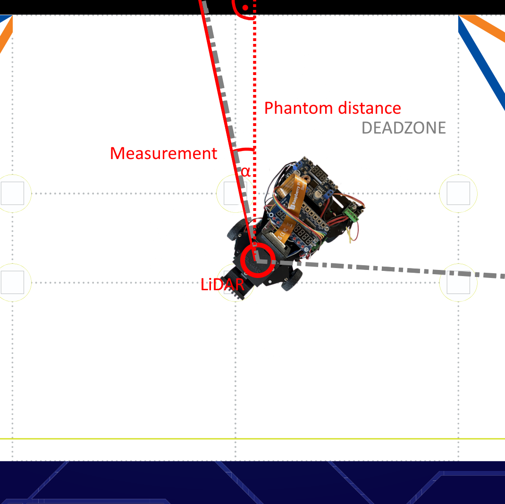
The area between the gray lines is the zone where the LiDAR is blocked, the dotted red line is where we want to measure (perpendicular to the wall) and the solid red line is the first non-deadzone angle where we can measure distance. Alpha is the difference between the measuring angle and the requested angle. By imagining the right triangle defined by $\alpha$, measured distance and phantom distance we can calculate the unknown length of phantom distance:

$$\text{phantomdistance}=\cos(\alpha)\cdot \text{measureddistance}$$

`readAbsLidar(angle)`<br>
Same as `readLidar` except it uses the IMU angle to calculate in absolute angles (the front wall is 0°, the wall to the right is 90° and so on).

`findNearestPoint(bottomLeftX, bottomLeftY, topRightX, topRightY)`<br>
Uses the LiDAR sensor to find the nearest detected object in the specified rectangle. The input coordinates are relative to the centre of the LiDAR. First, the rectangle's corner's `x`,`y` coordinates are mapped to a Polar coordinate system (to radius and angle from the origin). After this it checks the relevant angles, which are the angles between the bottom left corner's Polar angles and the top right corner's Polar angles. Then at all the relevant angles the angle and the LiDAR measurement (angle and radius) is converted back into `x` and `y` coordinates, relative to the center of the LiDAR sensor. After that, it checks if the converted point (x and y coordinate) is inside the rectangle defined by the parameters. If it is, then it gets stored. Finally it returns the closest stored point, which is the one with the lowest `y` value (relative to the center of the LiDAR). This function has two really important use cases. It can either be used, as the name implies, to find the nearest point and get its x and y coordinates relative to the robot. This could be used to decide the position of traffic signs for example, but for this we rather use the later detailed `findNearestObj`. The other use case is to simply check if there is an object in the selected rectangle or not, since if no objects were found it returns `-1`. This is the main use case, for example to check the driving direction during Open Challenge by looking for a "gap".
This use case visualized in our [custom sensor data visualizer](/other/RpiCode/README.md):<br>
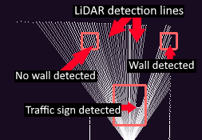
<br>(The white points are all what the LiDAR sees, the white lines are the "angles of interest", the red rectangles are where its checking for objects)

`findNearestPointAbs(bottomLeftX, bottomLeftY, topRightX, topRightY)`<br>
Same as `findNearestPoint` except it uses the bottom left corner of the current section on the mat as the origin point for the given coordinates (`bottomLeftX`, `bottomLeftY`,...) by measuring the distance to the left wall and to the back wall. If an object was found the detected point is returned also relative to the bottom left corner.

`findNearestObj(bottomLeftX, bottomLeftY, topRightX, topRightY)`<br>
Works similarly to `findNearestPoint` except it detects the start and end point of an obstacle (in our case a traffic sign). This data is represented by a `dataclass` with some key variables (starting point, endpoint) and some convenience methods such as calculating the centre of the object or checking whether the object was found or is `empty`. This data is crucial for detecting the color of the object.

`findNearestObjAbs(bottomLeftX, bottomLeftY, topRightX, topRightY)`<br>
Same as `findNearestObj` except it uses the gyro and the LiDAR to calculate the position relative to the bottom left corner of the current section, similarly to `findNearestPointAbs`.

`mapPointToCam(pointX, pointY, pointZ)`<br>
This function converts a point in 3D space, relative to the projection of the centre of the LiDAR on the mat to a pixel coordinate. After much thought we were able to reduce the problem to **two trigonometric functions**. First we calculate the X,Y,Z distance of the camera and the point using the known position of the camera. After this imagine the point of the camera and the given point viewed from above, and draw in the imaginary right triangle like so: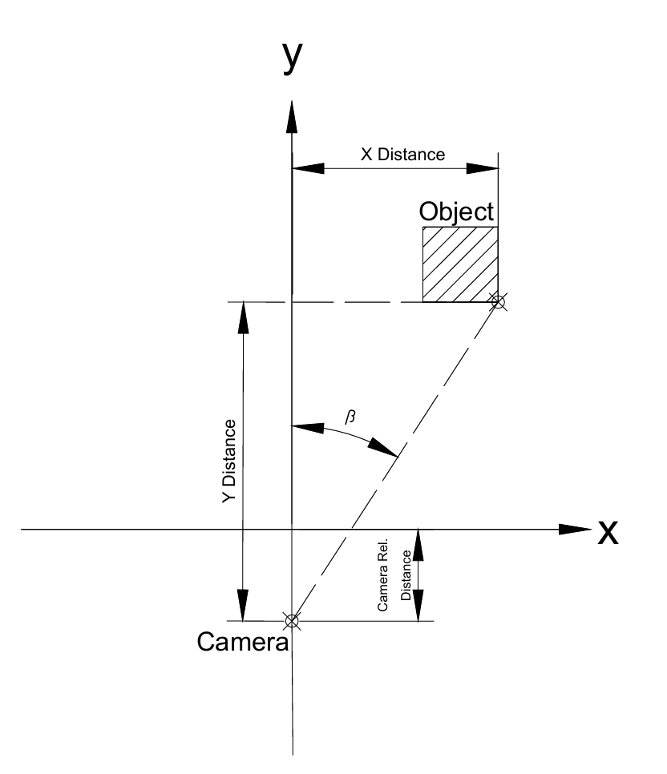<br>(X axis is sideways, Y axis is forward, example is detecting the top right point of a green traffic sign's front face)

Now do the same but viewed from the side:
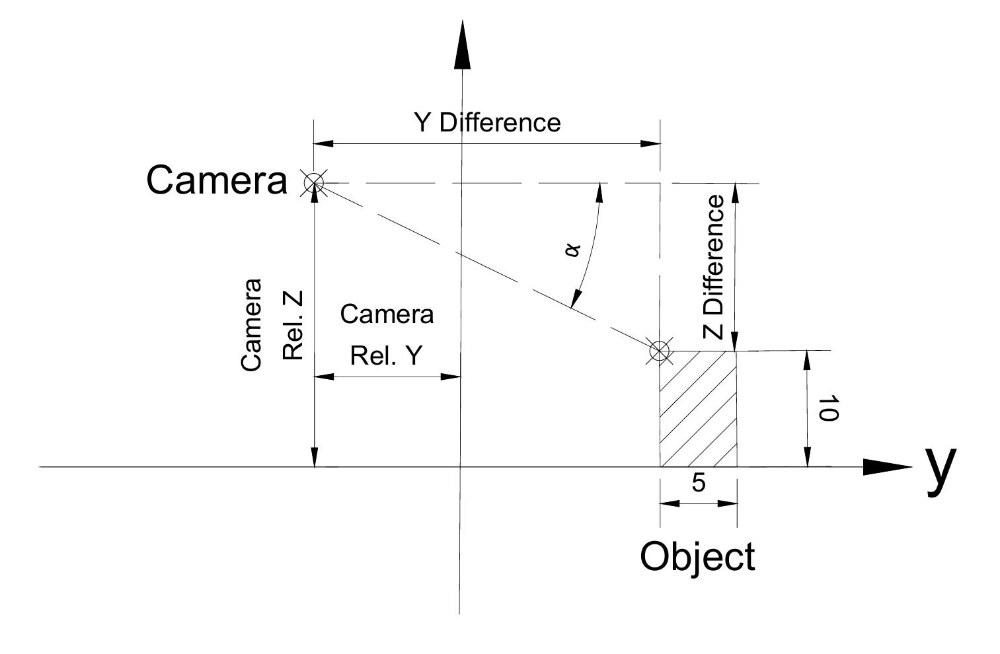
(Z axis is up, Y axis is forward, example is detecting the top right point of a green traffic sign's front face)

Using the known distances we can calculate α and β, which specify how many degrees the point is away from the centre of the camera horizontally and vertically. After measuring the `FOV` of the camera, assuming a linear relation between degrees and pixels (the image is not distorted) and factoring in the vertical (and possible horizontal) rotation of the camera we can calculate the pixel location of the object on the camera image:

$$x = \frac{640 px}{53\degree}\cdot \arctan(\frac{Z_{difference}}{Y_{difference}})$$
$$y = \frac{480 px}{41.5\degree}\cdot (\arctan(\frac{X_{difference}}{Y_{difference}}) + 15 \degree)$$

(The image is 640px*480px, horizontal FOV is 53°, vertical FOV is 41.5°, horizontal rotation is 0°, vertical rotation is 15°)

`detectObjectColor(Object obj)`<br>
Detects the color of the object by first calculating the pixel location of the top left point of the traffic sign and the bottom right point of the traffic sign gathered from the `Object` dataclass parameter. Then utilizing multiprocessing uses `cv2.mean` to calculate the average of the selected area, plus we add a safety border of around 5 pixels. Finally we subtract the `green` value from the `red` value, and compares this number to a well-calibrated border value to determine whether the sign is red or green.

### High-level functions

These functions are more complex, mostly made up of other framework functions.

`initLoop()`<br>
Always called at the start of the program, initializes some variables, establishes connection with the ESP and other sensors, starts all processes and waits until the first button on the LedAndKey panel is pressed, after which it returns, and the robot run can start. While the button is not pressed it uses the LedAndKey's display to show useful debug sensor data. With the press of the second button you can cycle between different displays. The LEDs also display useful diagnostics information.

`setTempo(newTempo)`<br>
Sets the *tempo* global variable alongside setting the current `targetSpeed`. We like to think of this like a speed limit sign as we can insert this before critical parts of the mission, like adding it to `turnCorner` to make every turn precise, or before switching lanes. Except instead of being a speed **limit** it specifies the target speed, it can also be inserted in the strategy to speed up the robot in long straight sections for example.

`calcLaneFromObs(column, color, wide_avoid)`<br>
Calculates to which lane the robot has to switch to in order to avoid the traffic sign in the given `column` and `color`. If color is red is returns the next lane to the right of the lane of the sign, and if it's green then the one to the left of it. One example:<br>
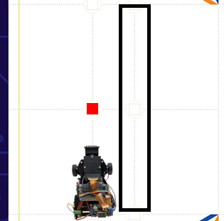<br>
Here the robot detects a red traffic sign in the left column and chooses the lane to the right of it. More details about the lanes in the strategy section.<br>
If `wide_avoid` is true it only returns the left lane or the right lane, thereby sometimes travelling extra distance. In the example above it would return the 40 cm wide section The parameter was added to make the surprise rule and future suprise rules easier to implement.

`switchLane(newLane)`<br>
Switches lanes to `newLane`, which is a constant specifying one of the *lanes* the robot can operate in. More on this in the strategy. After making some calculations, such as determining whether it will be a small distance or a long distance from `lane` and `newLane` and setting the `is_small` parameter accordingly, it calls `setLane` with the correct parameters.

`correctWallDist(walldirection, targetDistance)`<br>
Works similarly to `setLane` but moves at a very limited angle (10°) so arcing straight at the end won't affect the distance from the wall, enabling extra precise positioning. Designed for when the robot has to move straight for an entire section, so it has a lot of space for precise movements.

`waitEnsureDist(target_dist, allowed_deviation)`<br>
Ensures the robot is `target_dist` away from the front wall by backing up if the it's too close. `allowed_deviation` serves as a buffer, if the robot is only off by this much then no backing up is performed. This is useful when for example we want to turn around the corner at a specific point to end up in a specific lane. This way `allowed_deviation` can be used as leeway to avoid the time-intensive backing up manouver. The distance is always measured from the front wall by `readAbsLidar(0)`. 

`findFirstObsInNextSection()`<br>
Finds and returns the first traffic sign in the next section before the corner turn using `findNearestObjAbs()`. Does so by first detecting traffic signs in the first and second row (there can be only one), and if none was found then in the third row.<br>
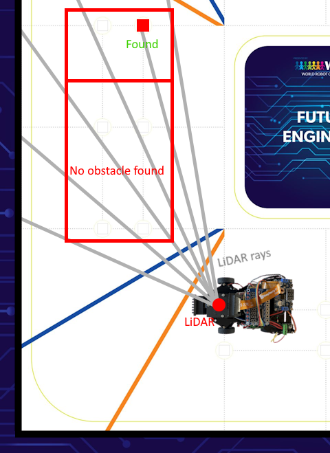

`turnCorner(targetLane, detection_careful)`<br>
Turns the corner at the and of a section. Is `detection_careful` is false then it performs a single arc at the correct distance away from the front wall to end up in the specified `targetLane` (which is one of the *lanes* the robot can operate in). If `detection_careful` is true it instead completes a turning manouver depending on the current *lane* of the robot which will end up backed near the backwall facing the first obstacles of the next section. More about the turning manouvers in the Strategy section.

`getFirstTurnTarget()`<br>
Calculated to which lane the robot needs to turn to during the optimized laps. Similar to `calcLaneFromObs()` except it performs one additional path optimization. If there are two signs of the same color in different columns we make sure to target the *inner* or the *outer* lane, prohibiting optimizing by moving to the *obstacle lanes* to avoid having to do a `switchlane` between the two.<br>
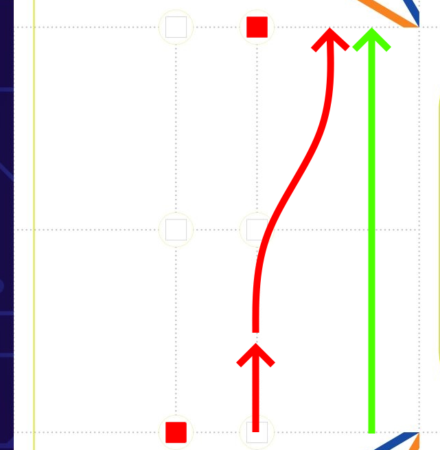
(Illustration showing the additional path optimization in action as the green arrow and the red arrow is without optimization)
## Robot run strategy

### Open challenge

In the open challenge the robot first determines the driving direction, then goes to the outer lane and completes 3 laps while staying on the outer lane the whole time, accelerating and decelerating to lower lap times but maintain precision where it counts.

The strategy of the placement of the robot inside the selected starting zone by us is the following:

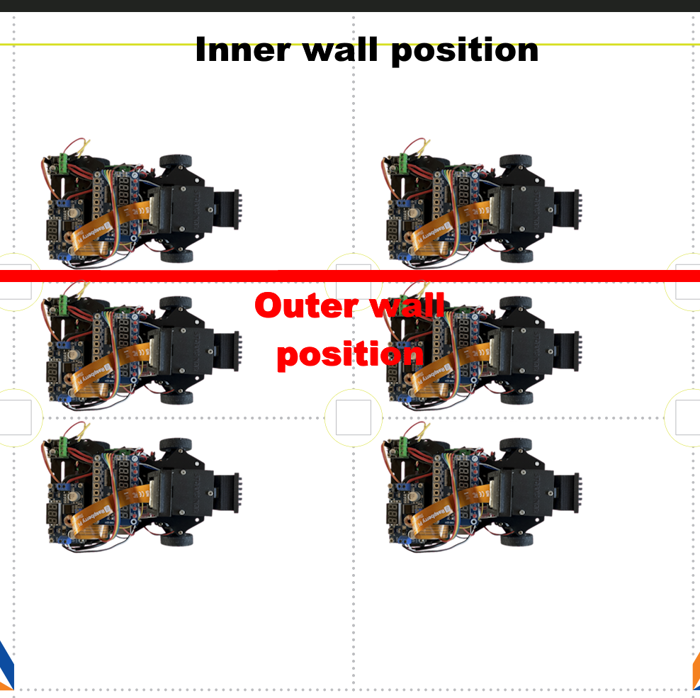

We try to have the robot near the center of the lane vertically, and somewhere in the middle horizontally.

At the start of the round the robot has to recognize the driving direction. This is done in multiple steps. First, the robot checks if it is directly next to a wall using the LiDAR sensor. This is only possible if the starting zone is one of the middle ones and the wall is on the outer position in the starting section, as can be seen on the previous illustration. If it is next to a wall that determines the driving direction for certain. If the wall is to the left of the robot then it will have to turn left at the corners and if it's to the right, then right. If a close wall was detected the robot will first move to the center of the available space by going at a 45° angle until the distance to the outer wall is half the available space (30 centimeters), then continue the round as normal.

An illustration showcasing direction detection:

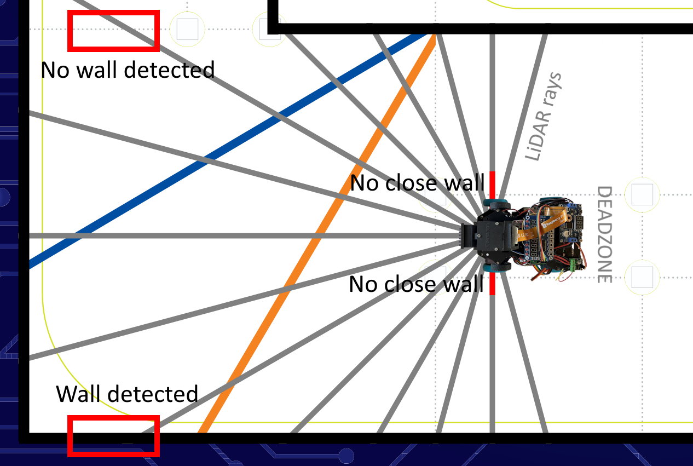

```python
if close wall detected:
  if close wall is to the left then:
    driving direction = counter-clockwise
    go at angle 45°
  if close wall is to the right then:
    driving direction = clockwise
    go at angle -45°
  wait until distance from outer wall is 30 cm
  go at angle 0°
  
```

If there are no close walls the robot will decide the driving direction using the LiDAR. To make the measurements reliable it first goes forward, and then using the powerful `findNearestPointAbs` function checks which direction the open space is, and from this determines the driving direction.

After this both cases join, and the robot enters a simple loop which consists of going straight and arc-ing in the right, previously decided direction in the corners. The robot goes forward until the distance from the front wall is so a 90° arc will end in the next straight section's outer lane. To maximize the speed of the robot while keeping the corner turns precise the robot accelerates in the beginning of the straight sections and decelerates before taking the turn. Since the robot only drives in the outer lane the walls' randomization is effectively ignored, therefore reducing the possible scenarios we have to test, enabling us to test these few scenarios more, and in turn increases the run's constancy. After every turn we set an angle offset variable so that "forward" will always be 0°, this way the 4 straight sections and turns are exactly the same. This can be seen in the following pseudo-code segment:

```python
repeat 12 times:
  go
  wait until distance from front wall is 55 cm
  arc 90°
```

Finally after completing 3 laps the robot stops in the middle of the starting section.

```python
wait until distance from front wall is 150 cm
stop
```

### Obstacle challenge

In the obstacle challenge the robot completes straight sections independently of each other, going around traffic signs and avoiding the parking space. First it parks out, detects the driving direction similar to Open challenge, then in the first lap checks the color and position of the traffic signs. After the first lap it follows an opimized path. Finally after 3 laps it returns to the starting zone with the parking space, after which it parallel parks.

Simplification was our main principle when solving the obstacle challenge. This year's strategy for the national finals is a compromise between the simple and reliable strategy used at the 2025 international championship and an optimized fast strategy we came up with. After implementing parts of the optimized strategy we realized it would be far too complex and hard to test and make sure its reliable, so we came up with this. This strategy massively speeds up the detection lap, while also keeping the simplicity of the old strategy. More about how and why we made this choice in the [Our Journey document](/Our_Journey.md).

First, we broke down the mat into 4 independsent **sectors**, each consisting of 1 straighforward section and 1 corner section. We also broke down the straightforward sections into 4 **lanes**, areas the robot can operate in.
#### Keywords
A short summary of the different keywords we will be using throughout the strategy documentation.
- **Section**: One of the 8 1 meter x 1 meter areas.
- **Straightforward section**: One of the 4 sections where the robot has to drive forward and avoid traffic signs.
- **Corner section**: One of the 4 sections with the orange and blue lines. Here the robot has to turn 90° to continue the on the field.
- **Sector**: Our own definition, consists of a corner section and a neighboring straightforward section in this order. There are 4 sectors on the mat.
- **Row** (straightforward section): On the Straightforward section there are 3 rows, in each of them are two possible traffic sign locations. They're numbered from 1-3, starting with the one the robot would first encounter with the current driving direction.
- **Column** (straightforward section): The dotted lines on the straightforward sections, each containing 3 possible traffic sign locations. They are named relative to the driving direction.<br>
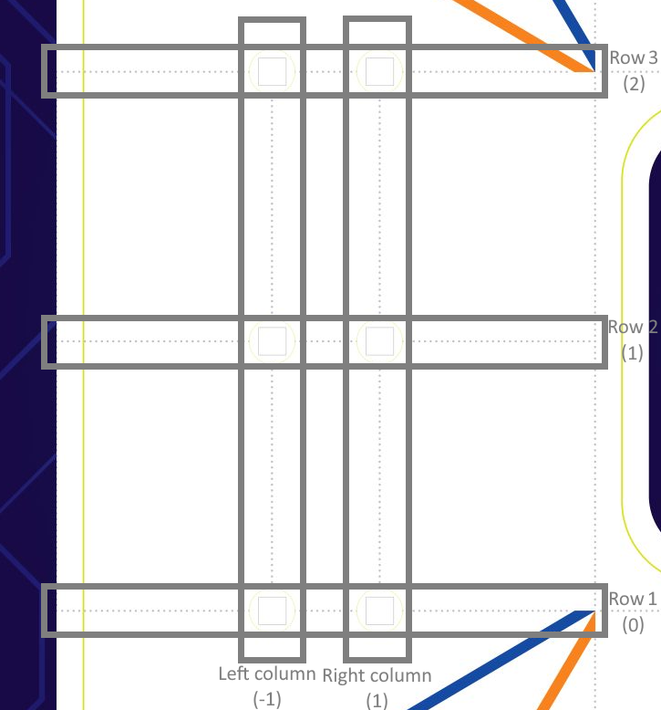<br>Illustrations showing the rows' and columns' position. The values in the parentheses is how we refer to them internally in the code.
- **lane**: Our own definition, specific walldistances in the straightforward sections where the robot can operate. We have 4 lanes. The two 40 cm wide areas and the dotted lines (columns) are considered lanes. The latter are also referred to as *obstacle lanes*, but they are full value-fledged lanes.<br>
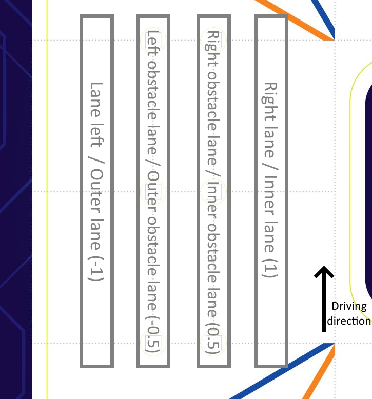<br>
Here these lanes are illustarted as a wide rectangle, but in reality they are 1 specific walldistance, a line. Of course the movement of the robot isn't perfect, so it's rarely at the exact distance, but we try to minimize the offset to at max 10 cm. This is what we use `correctWallDist()` for.<br>
We mainly refer to these lanes relative to the driving direction (left, right...), but sometimes we need to refer to them relative to the walls of the field (inner, outer...). The distance between two neighboring lanes is 20 cm. The value in the parentheses is how we refer to them internally in the code.

Our goal was to make only a handful of possible driving scenarios on the straightforward and corner sections, and make them completely independent of each other. This vastly reduces the different cases we have to test.
#### Leaving the parking space
Start of the round the robot has to leave the parking space. This is a very precise operation so to eliminate slippage the robot moves at a **very** slow speed. Thankfully the robot can leave the parking space in one continuous arc. However, depending on the traffic sign in front of the robot and the driving direction there are still 4 scenarios.<br>If the driving direction is counter-clockwise, the robot first arcs out so the traffic sign on the third row can be detected. Then the obstacle is avoided according to its color:
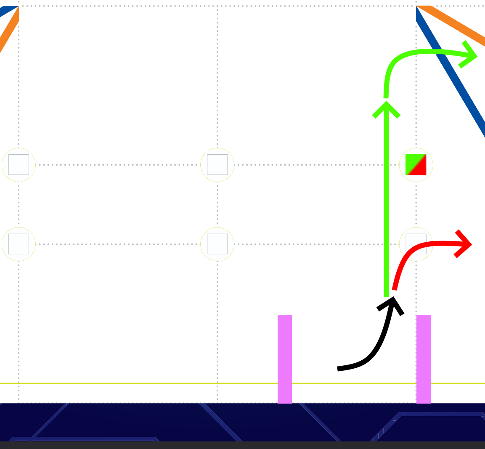
(If there is no traffic sign we treat it as if there were a red traffic sign)

If the driving direction is clockwise, then the robot will have to avoid the traffic sign on the middle row *or* the one on the last row. The robot moves into a position where it can detect the color of potential traffic signs on the second *and* third row. After this it avoids it according to its color:
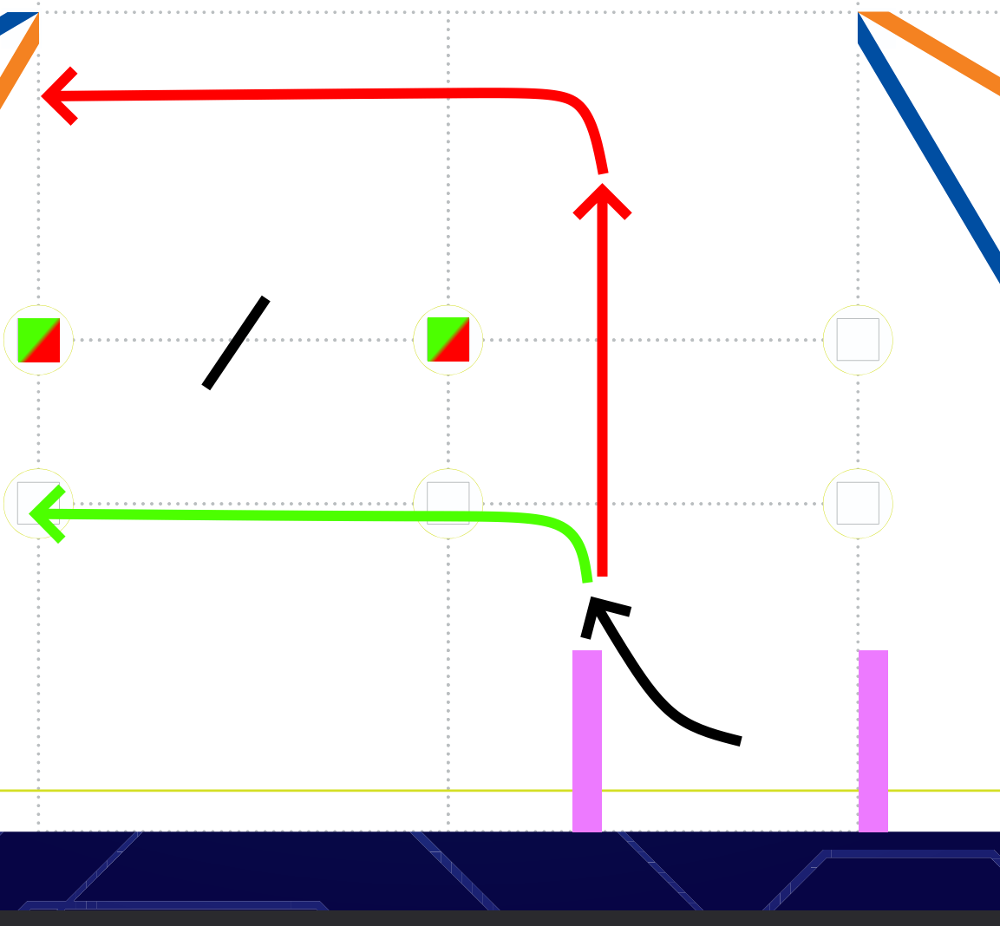
(There can only be one traffic sign, either in the second or third row. There can also be no traffic sign there, which we treat as if a red traffic sign were there.)

After this the execution is passed to the detection lap loop, the robot is considered to have finished the first **sector**.
#### Detection lap
In this lap the robot has to detect the colors of all the obstacles (minus potentially the first one already detected during the parking out), and store them. We have a two-dimensional array with 4 sub-arrays for the 4 sections and in each sub-array 3 fields for the 3 rows. We call this the `trafficSignMatrix`. Each obstacle is stored as a number with a sign (-/+). The sign represents the column (-: left, +: right) and the number the color (1:GREEN, 2:RED). 0 is the default value, it means there isn't a sign on this row. So for example a red sign on the left row would be represented by `-2`.

Each **sector** is comprised of a corner segment and a straight segment, in this order. Before the turn the robot scans the next section using `findFirstObsInNextSection`. Then it performs a corner turn depending on the detected obstacle's position. There are 2 cases, depending on whether the first traffic sign is in the first row or not.

If it isn't, then the robot can perform a single arc at a calculated distance from the front wall in order to end up right in front of the detected sign, regardless of the current lane of the robot.

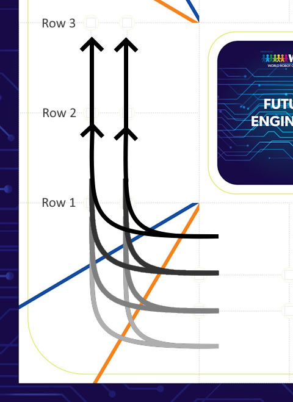

The obstacle in the 2nd and 3rd row are treated the same, the only difference is for the 3rd row we move a bit closer before taking a photo. After detecting the sing's color we perform a lane switch to the lane calculated by `calcLaneFromObs`. Since we are facing the sign we at most have to switch over 1 lane, ensuring the switch can be finished before the end of this sector, in the straight section. 

If the first sign is in the 1st row then the robot sadly can't always turn in to face the obstacle. Even when it could (coming from the outer lane) after detecting it and completing a `switchLane` there may be a seconds sign on the third row. We found the robot can't always complete two switchlanes when starting from in front of the first sign. For this reason, and to keep the flow of the program simpler if there is a sign on the first row we always perform a turning manouver which ends with the robot backed up to the backwall and facing the first sign. This does cost considerably more time, but keeping the number of cases to a minimum and keeping sections completely independent of eachother is worth it in our opinion. There are 4 lanes the robot could be coming from but only really two manouvers, as the *inner* and *inner obstacle* lanes and the *outer* and *outer obstacle* lanes are treated as the same with minor differences. Each manouver has two versions depending on where it has to end up (facing one of the columns), but the only difference is where the robot starts the manouver.<br>The manouvers from all lanes, with the inner and outer lanes targeting the inner column and the obstacle lanes targeting the outer column:

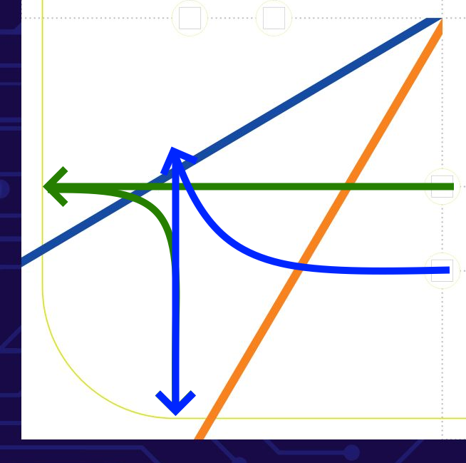 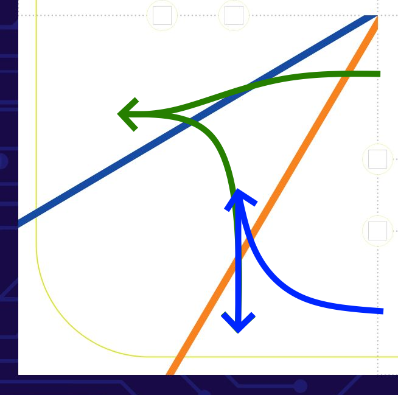

The inner lanes' manouver is a simple backwards arc, only difference being that in the inner lane the robot moves a bit outer to avoid hitting the (possible) first traffic sign of the next row. The outer lanes' manouvers are identical, to avoid hitting the (potential) signs in the first row the first arc is incomplete (70°), the robot straightens itself while backing up. After each turn we set an angle offset variable, same way as in Open Challenge, to ensure front is always 0°, right is 90° and so on.

After completing the turn the robot detects the color of the traffic sign in front of it and switches to the lane calculated by `calcLaneFromObs()`. Then it checks if there is a sign on the third row. If there isn't one, the robot speeds up by upping the *tempo* and performs a `correctWallDistance`. The speed up is due to the robot moving straight for a long distance, and the correcttion is to correct the position of the robot in the middle of the section. If it's gyro is off by even a few degrees this adds up over 1 meter. If there is one in the htird row then it detects it's color and switches lanes accordingly, finishing the section.

As the result of the many simplifications we made to the challenge, only a handful of operations need to be fine-tuned and tested: The two backing-up-turn manouvers, the one-arc-turns' distances to start the arc and `switchlane` needs to work correctly for 20-40-60 cm wide lane switches.

After completing the first lap we no longer have to detect the color of the obstacles, which leaves the door open for further optimizations.

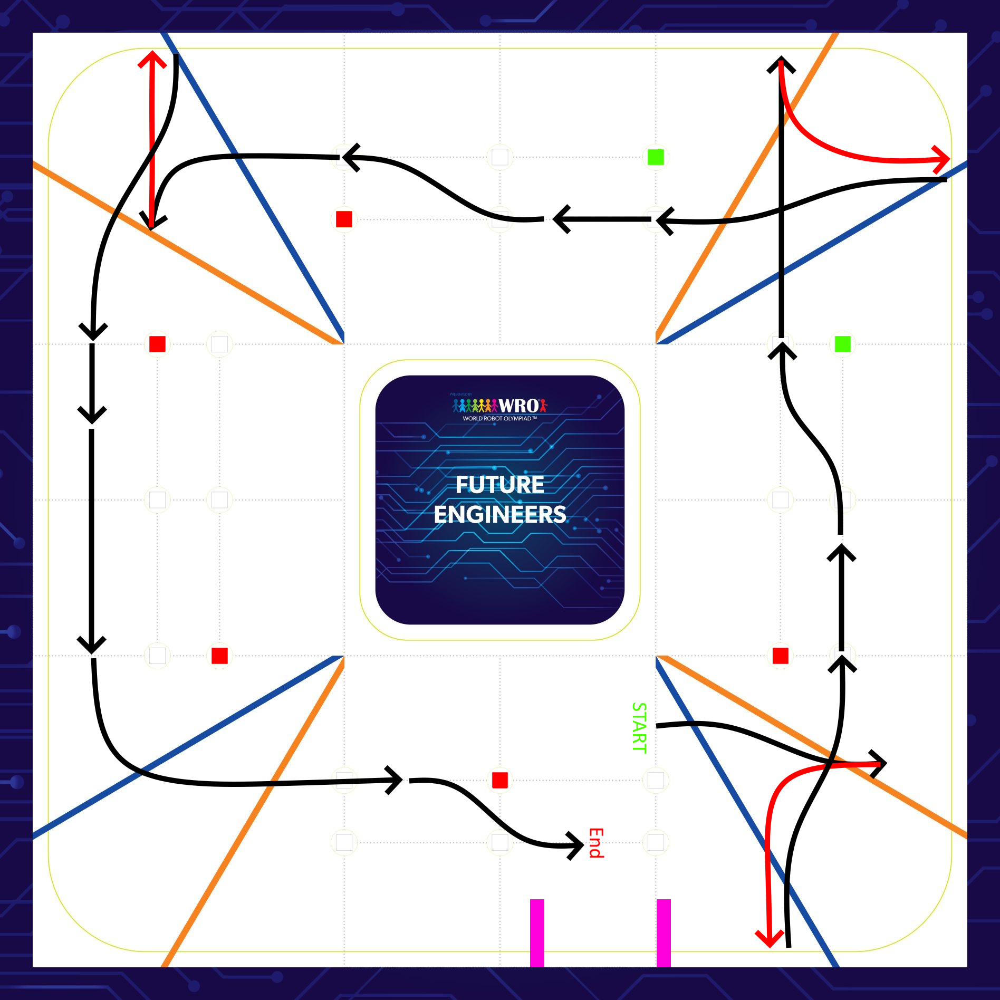<br>
(Illustration showing a full detection lap starting from START. The red arrows represent backing up)

Pseudo code of the detection laps:
```C
repeat 4 times:
  #at the end of a straight section, before turncorner
  findFirstObsInNextSection()
  if detected obstacle is in first row:
    turnCorner(detected obstacle's lane, detection_careful=True)
    detectObjectColor()
    switchlane(calcLaneFromObs(column, color))
    if obstacle detected in 3rd row:
      detectObjectColor()
      switchLane(calcLaneFromObs(column, color))
    else:
      correctWallDist(closer_wall) //Looking at the closer wall
  else:
    turnCorner(detected obstacle's lane, detection_careful=False)
    detectObjectColor()
    switchlane(calcLaneFromObs(column, color))
```
(Many parameters are left out and variables are treated as-is, the code mainly serves to illustrate how we actually coded the challenge code in Python)

Flowchart of the detection sectors:<br>
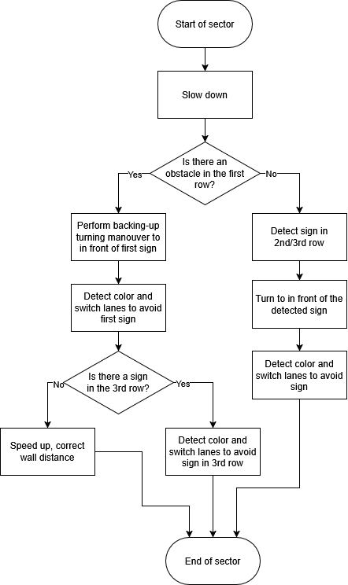

#### Connecting the loops
From an abstract point-of-view our code consists of a detection loop doing 1 lap and an optimized loop doing 2 laps. However in reality we already potentially detected a traffic sign during parking out. For this reason we have a special, inbetween sector we call *early-detect*. This sector combines elements of both loops. It checks whether there is a previously not seen sign and if yes detects it just like it would in the detection loop. There is at most 1 undetected obstacle, because we already checked 1 or 2 locations during parking out. After detecting the sign (or not if there wasn't an undetected one) it continues on like an optimized section.

#### Optmized laps

After all obstacles have been detected, the robot follows a much more optimized path. Most of the optimization comes from always knowing where to turn in the corner. After turning it may have to perform one more switchlane to finish the section.

The robot is able to complete the turn from one lane to another in one continous arc, a massive improvement from the detection laps' complex manouvers. Since the robot already knows the color of all obstacles, it can make one of the following turns based on it's current lane and the target lane, calculated by `getFirstTurnTarget()`:<br>
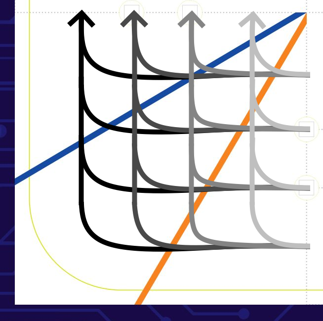<br>
As it's visible here this results in a ton of different turns, but really the only difference is a number telling the robot when to start the arc, so the incoming lane doesn't matter, we only have to fine-tune 4 values. 

Although the robot is able to complete these turns in one arc, sometimes previous delays stack up, and it might already be over it's target position. This is combatted by `waitEnsureDist()`, which backs up if too close. This perfectly ensures the previous sector(s)' delays won't effect the current sector's, at the price of a time-intensive backup manouver.

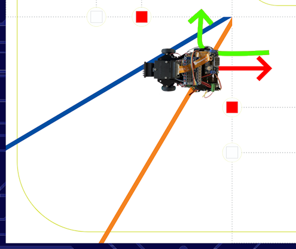

We only have to do a switchlane if there are two different colored traffic signs in the section. Even though there could be two of signs of the same color we optimize our path to turn in to the lane which satisfies both signs, as described in the framework documentation under `getFirstTurnTarget()`, eliminating the need for a mid-section switchlane in this case. If we do need to switch lanes we switch to the optimal lane calculated by `calcLaneFromObs()`, finishing the sector.

Here's what an optimized lap might look like, showcasing many different optimizations:<br>
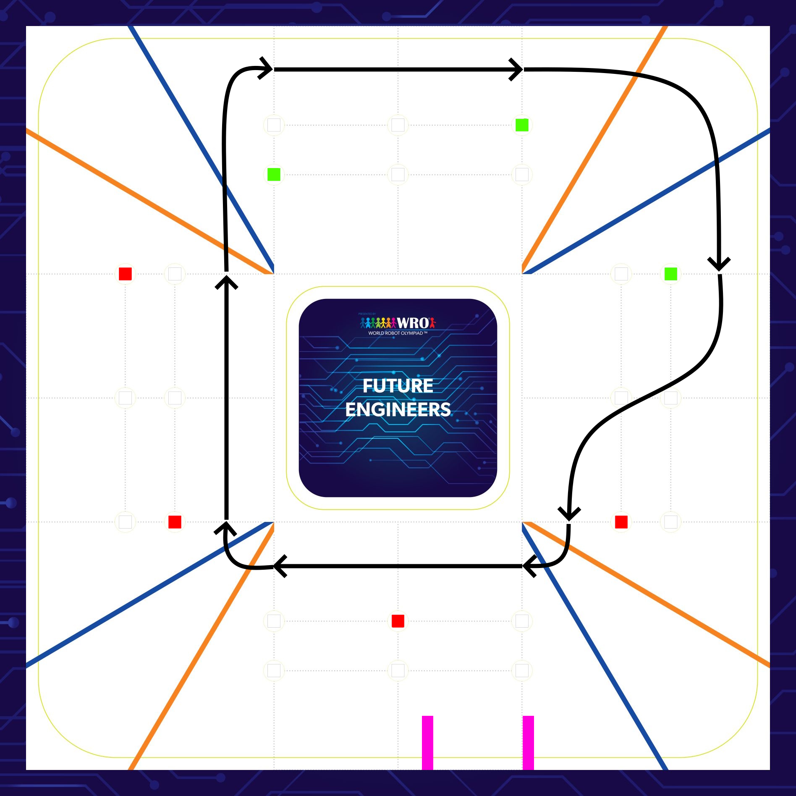

With these optimizations we were able to shave down about 70 seconds from our run time, without sacrificing simplicity or reliability.

Pseudo-code of the optimzed laps:

```python
repeat 4*2 times:
  #at the end of a straight segment, before turncorner
  turncorner(according to the color of the 1st (and potentially 2nd) traffic sign in the next section)
  if(there are two traffic signs in this section and they are of different color):
    switchlane
  else:
    correcttWallDist
```

Flochart of the optmized sectors:<br>
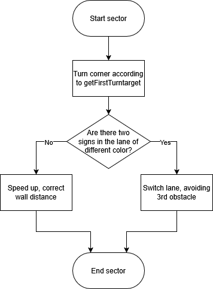
#### Parking

After completing 3 laps, just before entering the starting sector the robot starts the parking procedure. We again strived for simplicity and decided to develop **one** parking maneuver and fine tune it. If there is a traffic sign on the first row of the section it still has to avoid it in the correct direction. If according to the color the robot has to move to the outer lane, or there is no traffic sign there then the robot completes parking like so:
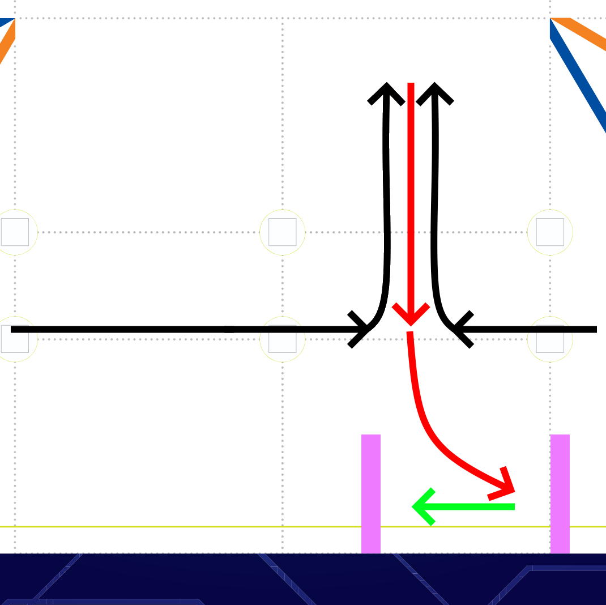
The robot comes from either the right or the left, depending on the driving direction, this is represented by the black arrows. Red arrows mean driving backwards, green means forwards. Accuracy is key during the maneuver so the robot moves very slowly and constantly senses its surroundings.
<br>However if the sign requires the robot to move in the inner lane we can't complete this unified parking maneuver. To make it work we have to avoid the sign by moving to the inner lane. Then we switch to the inner lane, and back up (making sure we don't pass the traffic sign in the wrong direction):
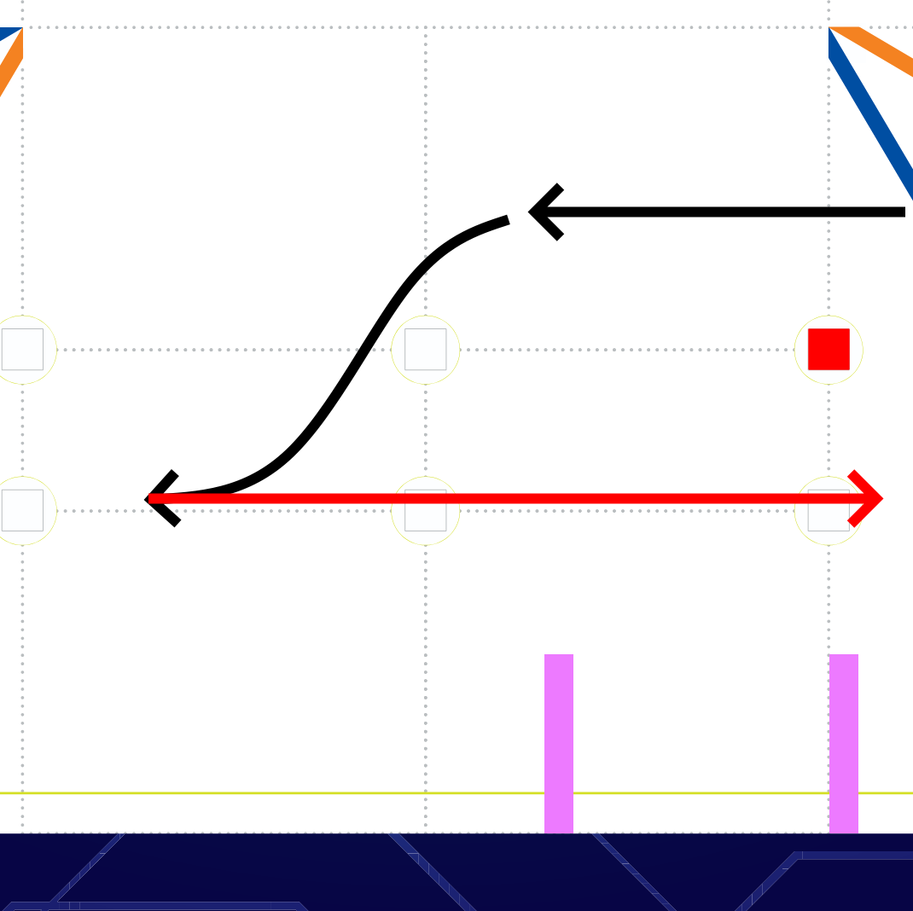
 After this we assume the unified parking position and complete parallel parking regularly.

### Suprise rule
For the first time in Future Engineers history there was a surprise rule announced a few weeks before the national finals, for both the Open and Obstacle challenges. Before modifying the code we uploaded it to GitHub and made sure to mark every changed line for the suprise rule to make reverting to the base challenge simple.
#### Open challenge
For this challenge the change was minimal, and it didn't effect us at all, since our strategy was already to drive on the outer lane of the mat. But since the time of the Open Challenge run is super unlikely to matter we are prepared to slow down the robot if there is any uncertainty in the run.
#### Obstacle challenge
First we tested if the robot can detect the LEGO minifigure. It couldn't reliably. This meant we had to plan for both detecting and not detecting the mini. If we detect it there is no problem. The robot will simply treat it as a traffic sign, take a photo and assign it whatever color it happens to detect. It will always avoid it.

If it doesn't detect it (majority of cases) we have to keep in mind that the mini has to be at a valid traffic sign spot. So we just treat every valid traffic sign spot as being occupied, even if the LiDAR didn't find anything there.<br>
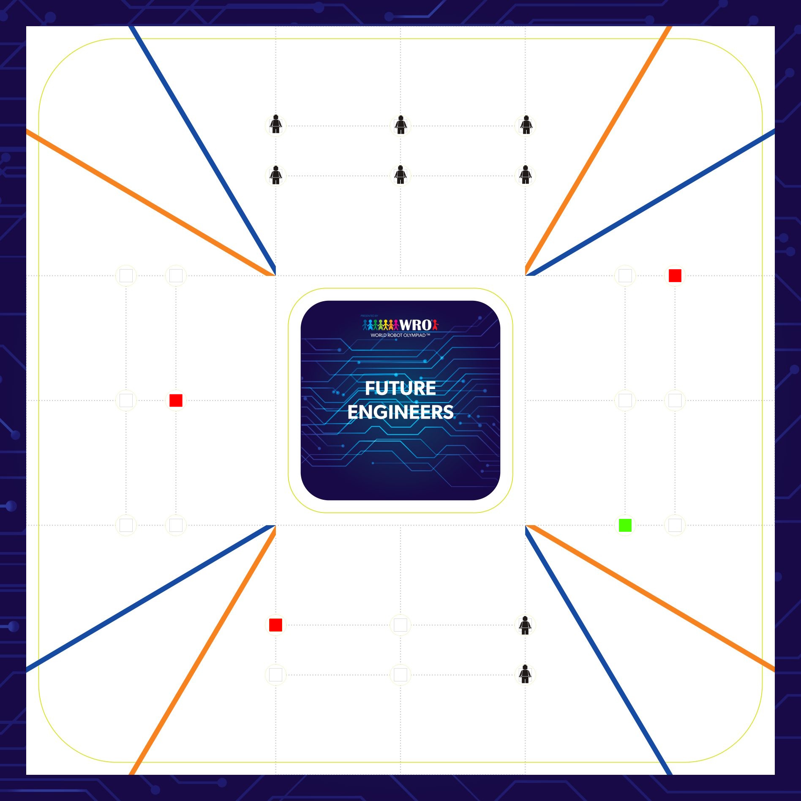<br>
(Illustration showing detectable obstacles and where the minifugre could be.)

During the detection if we detect a sign in the middle row we know that section is safe, nothing is changed.

If we detected a sign in the 1st row we do what we normally would, with the important change that we can only switch to the outer or the inner lane. The robot can't end up in one of the *obstacle lanes* to avoid hitting the minifigure, so we set `wide_avoid` to **true** in the `switchlane`.<br>
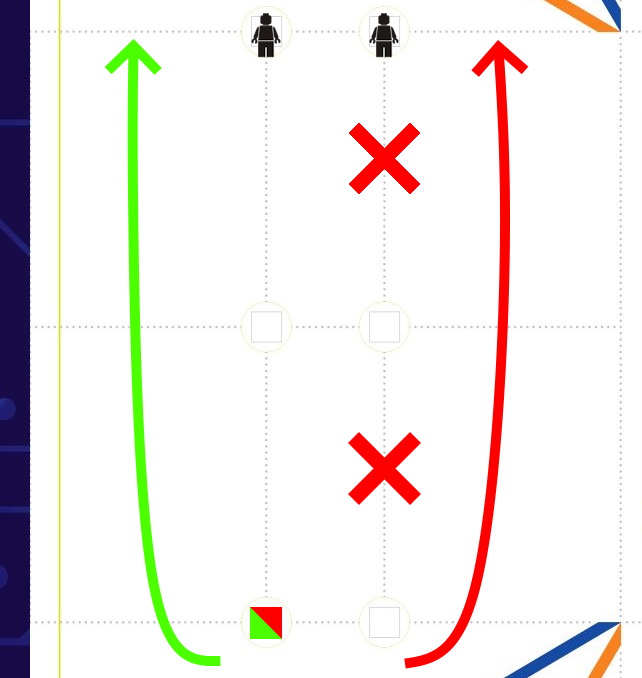<br>
(The green arrow is the path the robot would take if the sign's color is green, the red is if it's red, the X-s mark the avoided lane)

If we detected a sign in the 3rd row we can't know the mini isn't in the 1st row so we have to avoid it by performing the turn as if there was a sign in the 1st row. Then we override the detection of the color for he nonexistent sign with an arbitrarily chosen color. We chose the color that takes us to the right lane if the sign on the 3rd row's in the right column and vice-versa, also setting `wide_avoid` to true. After that we detect and avoid the sign as we would normally in a 2 sign section.<br>
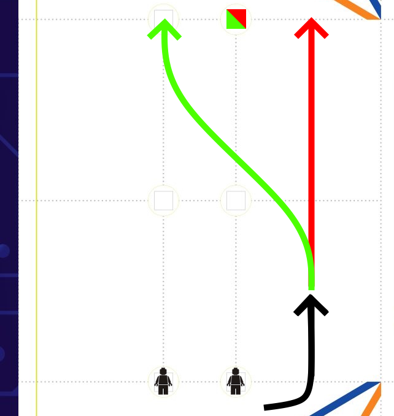<br>
(We avoid the potential minifigure from the right because the detected sign is in the right column)

The surprise rule also introduces a special case that we haven't dealt with before, a seemingly empty section. Previously this meant something went wrong but now this is a valid state. In this case we just move to the outer lane to avoid the minifigure.<br>
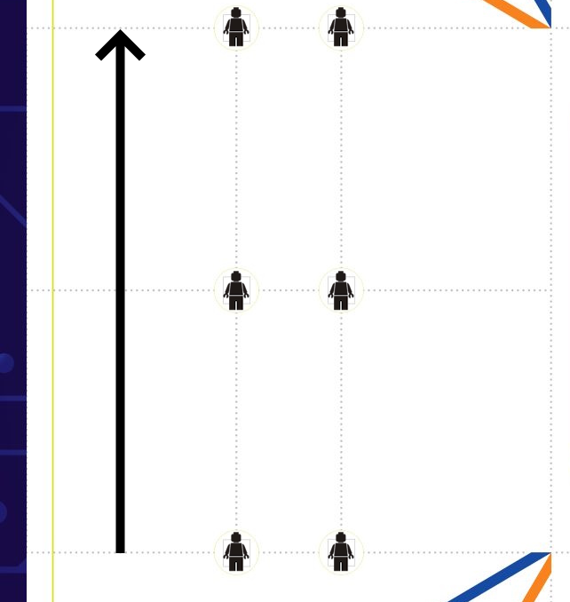<br>

Since the surprise rule stated that the minifigure can't be in the starting segment the *early detect* (section between detection and optimized loops) code did not have to be changed.

We also realized we don't have to change the optimized laps at all, if we fill out the `trafficSignMatrix` (2 dimansional array conatining detected signs) to avoid every potential minifigure position.<br>
If the section contains a middle sign or 2 signs nothing had to be changed, the minifigure can't be in this section. If it contains 1 sign in the 1st or 3rd row we have to make sure it doesn't optimze it's movement through an *obstacle lane* and hit the minifigure. If it's in the 1st row then we have to make sure it doesn't switch lanes into the *obstacle lane* next to the traffic sign. This can happen for example if we had detected a red sign on the left lane, in this case the robot would switch to the *right obstacle lane*. We can combat this by creating a fake traffic sign in the 3rd row with the same color but in the other column. In the strategy we specifically optimize the run by checking if there are 2 obstacles of the same color and if yes then turning straight into the lane that avoids both of them to avoid making an extra lane switch. We do something similar if one sign was detected in the 3rd row, but we create the fake traffic sign in the 1st row. There is also the case of the empty section. Here we create two obstacles of the arbirarily chosen color and place them on the 1st and 3rd rows, on different columns. An illustration showing a randomization and where the fake traffic signs were created:<br>
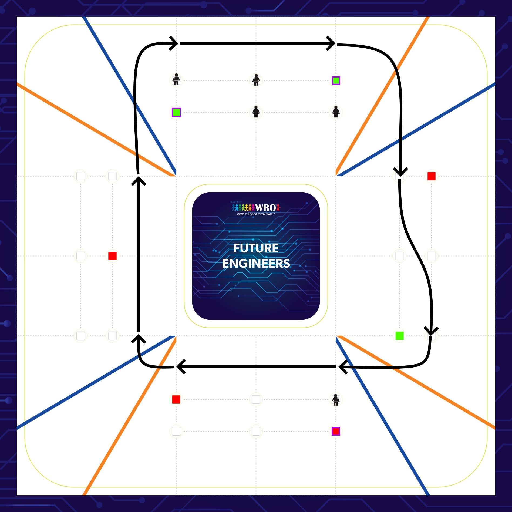<br>
(The fake obstacles are outlined with purple, the black arrows show the path of the optimized laps, the black figures show the possible positions of the LEGO minifigure)

Initially we also had an idea to simply forbid the robot from ever going to the *obstacle lanes*. The main timeloss of the optimized laps is situations where we have to backup at the end of a section because the robot finishes the section too late. This happens around sections with 2 different colored signs, and by keeping these optimized we avoid losing a lot of time compared to the simpler solution of just diabling the *obstacle lanes*.

## Software setup guide

This document serves as a guide for installing the necessary software and setting up environments on the programming computer, [Raspberry Pi 5](https://www.raspberrypi.com/products/raspberry-pi-5/) and [NodeMCU-32S](https://docs.ai-thinker.com/_media/esp32/docs/nodemcu-32s_product_specification.pdf) device. We tried to be as precise as possible when describing the steps, however if we did miss something let us know and we will try our best to help solve any problems. You can contact us at csabi@molnarnet.hu (Csaba) or andrasgraff@gmail.com (András).

### Programming computer

This can be either a laptop or a PC. We tested everything on a laptop running Windows 10, and one running Windows 11.

#### Python code editor

We used Visual Studio Code, but theoretically any code editor works. However we **strongly** recommend VScode, since the upcoming steps will be VScode-specific.
First you have to install [VScode](https://code.visualstudio.com/download). You will also need to download [Python 3.12](https://www.python.org/downloads/release/python-3120/). To connect the two finally you need to install the [Python extension](https://marketplace.visualstudio.com/items?itemName=ms-Python.Python) for VScode. Another extension we recommend downloading is [PyLance](https://marketplace.visualstudio.com/items?itemName=ms-python.vscode-pylance) which enables autocorrect for Python. To be able to download files to the Raspberry Pi you also need to install our custom-made extension **RpiCode**. This extension does way more than just upload files, for the installation process and full list of features, go to the **[other/RpiCode](/other/RpiCode/)** folder. Some libraries are Raspberry Pi **native**, so they aren't installed on the computer, the only nuisance this causes is the lack of autocomplete for those specific libraries. We simply chose to ignore this, however if you find autocomplete important you could "emulate" a library by creating a blank **.py** file with the function and class names of the missing native library, or look up how to install said library on windows.

#### Arduino IDE

The [Arduino Integrated Development Environment](https://www.arduino.cc/en/software) was our choice of software to develop on the **NodeMCU-32S** microcontroller. It's originally made for arduino microcontrollers, however it being **open source** allows manufacturers to develop custom board managers for their own microcontrollers. This is also the case with the NodeMCU-32S which is an **ESP32** microcontroller, so you will need to install the ESP boardmanager. For this we followed this tutorial ([https://www.aranacorp.com/en/programming-an-esp32-nodemcu-with-the-arduino-ide/](https://www.aranacorp.com/en/programming-an-esp32-nodemcu-with-the-arduino-ide/)). Now just make sure the attached libraries in the [src/ESP/libraries](ESP/libraries/) folder are next to the **run.ino** file in a libraries folder.

### Raspberry Pi 5

#### Setup

The Raspberry Pi 5 should have Raspberry Pi OS 64 bit downloaded. You need to create a folder that will be the destination of the file upload for the [RpiCode Extension](/other/RpiCode/README.md). You will need to install a few Python libraries using the **`pip`** tool. Pip most likely got installed along with Python but just in case it can be downloaded here: [https://pip.pypa.io/en/stable/installation/](https://pip.pypa.io/en/stable/installation/).

#### Installing libraries

- `pip install rpi-lgpio`
  - **GPIO** pin manager library for Raspberry Pi 5
- `pip install serial`
  - **Serial** communication library
- `pip install rpi-TM1638`
  - [TMBoard](https://thilaire.github.io/missionBoard/TM163x/) panel library
- `pip install picamera`
  - **Camera** module
- `pip install opencv-python`
  - **OpenCV 2** Python library
  
If you successfully install the libraries but still receive a module not found error try replacing the `pip` keyword with `pip3` or `pip3.12`.

There are some other libraries that don't need to be installed using `pip` because the source file is attached in the [src/RaspberryPi](RaspberryPi/) folder.

For the upload function of the extension to work the computer needs to be on the same WiFi as the Raspberry Pi. This can be achieved many different ways, we opted to use the Pi as a host and connect with the computer to the hotspot. Following the [official documentation](https://www.raspberrypi.com/documentation/computers/configuration.html#enable-hotspot) you have to type the following command into the terminal to start a hotspot:

`sudo nmcli device wifi hotspot ssid <example-network-name> password <example-password>`

To automatically start the hotspot every time the Pi boots up, you can append the command to the `rc.local` file which you can edit by typing `sudo nano /etc/rc.local` into the terminal.

The final thing to do is to enable program start on **boot**. This can be done in many different ways, here's a tutorial ([https://www.dexterindustries.com/howto/run-a-program-on-your-raspberry-pi-at-startup/](https://www.dexterindustries.com/howto/run-a-program-on-your-raspberry-pi-at-startup/)) we followed that explains 5 different methods.

### NodeMCU-32S

#### Connect

The microcontroller needs to be **connected** to the computer via a micro USB cable, or a USB-C cable if you're using a newer model. If you followed the previously linked [NodeMCU tutorial](https://www.aranacorp.com/en/programming-an-esp32-nodemcu-with-the-arduino-ide/) correctly and after plugging the device in this message should appear in the bottom right corner:  
If this is the case then just pressing the **upload** button should start the code.

# Contact

If you have any further questions feel free to contact us at csabi@molnarnet.hu (Csaba) or andrasgraff@gmail.com (András).
